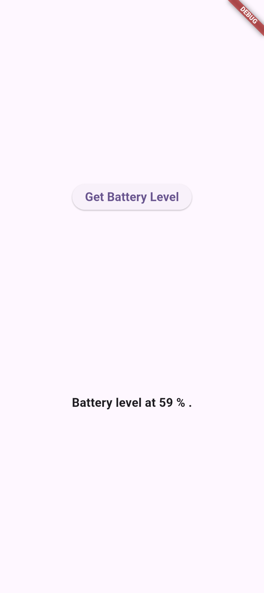

# Flutter Platform Channels Tutorial

## Project Specifications
This project is a Flutter application built to demonstrate the integration of **Platform Channels** (`MethodChannel`). It allows the Flutter (Dart) client to communicate seamlessly with the native host (Android/Kotlin) to perform non-trivial, platform-specific tasks.

### Core Features:
* **Battery Level Retrieval:** Uses `MethodChannel` to call the native Android `BatteryManager` API to fetch and display the current battery percentage of the device.
* **Device Vibration:** Implements native Android specific code to trigger device vibration for a set duration, demonstrating one-way message passing from Flutter to Native.

### Technologies Used:
* **Framework:** Flutter / Dart
* **Native Host:** Android (Kotlin)
* **Architecture:** Message Passing via `MethodChannel` (`samples.flutter.dev/battery`)

---

## Group Members
* [Mufaddal] - [2380038]
* [Hashir] - [2380243]
* [Amna] - [2380226]
* [Sani] - [238256]

